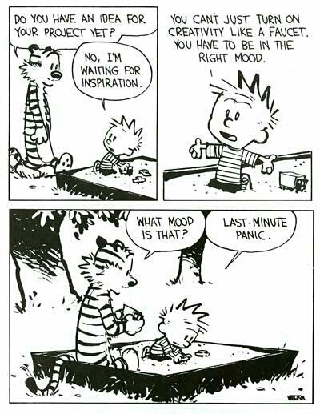

# Project

**Goal:**
Write something about data mining *that other people want to read*.

**Teams:**
You may work in teams of 1-3,
dividing the work however you deem fair.

**Topics:**
You may select any topic you'd like, as long as it is somehow related to data mining.
(Any data mining topic is fine, and not just something we covered in the course.)
Possible topics include:

1. Pick 3-5 interesting research papers and write a high level summary

   Examples:

    1. https://izbicki.me/blog/data-mining-images-tutorial.html

    1. https://izbicki.me/blog/converting-images-into-time-series-for-data-mining.html

    1. https://medium.com/@hyponymous/a-month-of-machine-learning-paper-summaries-ddd4dcf6cfa5

    1. https://pemami4911.github.io/paper-summaries/

    1. https://www.topbots.com/most-important-ai-research-papers-2018/

1. Pick an interesting data set, and do a cool analysis of the data set

    Examples:

    1. https://datainsights.pub/reddit_political_leanings/

    1. https://datainsights.pub/fair_pay_to_play/

    1. https://datainsights.pub/claremont_news/

1. Pick a data mining concept and explain it with an intuitive example

    Examples:

    1. https://izbicki.me/blog/how-to-cheat-at-settlers-of-catan-by-loading-the-dice-and-prove-it-with-p-values.html

    1. https://izbicki.me/blog/how-to-create-an-unfair-coin-and-prove-it-with-math.html

    1. redo the SLT homework for neural networks/ensembles/decision trees

1. Write a tutorial for a data mining library

1. Contributing to the documentation of a data mining library

I encourage you to pick a topic that's related to something else you are also working on
(another class, research, senior thesis, etc.).

**Publishing:**
You may publish your writeup anywhere online that is convenient for you,
but it must be somewhere publicly accessible.
A particularly convenient way to publish is on a personal blog
(if you don't have one, I strongly suggest you create one!),
or in a github `README.md` file.

Depending on what you're writing about,
another good format is as a jupyter notebook that other people can easily download and run directly.

**Grading:**
Your grade will be determined by the number of people who read your article and share it on social media.
Well written articles about interesting topics will be more likely to get widely read and shared.
A widely read/shared article will also help you professionally in the future.

The following table will be used to determine your grade.
Of the four right-most columns that measure engagement with your writeup,
whichever of those columns is highest,
that's what your grade will be.

| Project Grade | Course Grade (*) | Pageviews | Reddit Upvotes | HackerNews Upvotes | Retweets | Facebook Likes |
| ------------- | ---------------- | --------- | -------------- | ------------------ | -------- | -------------- |
| 20 / 20       | A+               | >5,000    | >200           | >100               | >200     | >200           |
| 15 / 20       | A                | >3,000    | >150           | >75                | >150     | >150           |
| 11 / 20       | A-               | >1,500    | >100           | >50                | >100     | >100           |
| 8  / 20       | B+               | >1,000    | >50            | >35                | >50      | >50            |
| 5  / 20       | B                | >500      | >25            | >25                | >25      | >25            |
| 2  / 20       | B-               |           |                |                    |          |                |

(*) This is the grade you'd get in the course if your grade on the non-project portion of the course is 90%.

*I may choose to raise your grade if I feel that it was better than the social media engagement indicates.*

**Why grade like this?**
Several reasons:

1. This is an entirely objective grading system

1. This system rewards projects that actually contribute to global knowledge

1. Forces you to make your writing concise and interesting

1. This is a "light" version of how grad school data mining classes are graded

1. Blog posts are a great way to establish a "personal brand" and get job offers

**Other Requirements:**
Your writeup must include a link to https://izbicki.me .
At the very bottom of the page in a footer note is probably the best way to do this.
(I want your sweet, sweet, pagerank...)

**Due date:**
~~December 4th is the last day of finals week,
so I will use the engagement stats of your writeup on this date to determine your grade.~~
Monday, Decemeber 7th.

The sooner you publish your writeup, however, the more time you will have for random people on the internet to discover it, and so the more engagement you will get and the better grade you will get.

I recommend having your writeup finished and published before Thanksgiving (**Nov 26**).
Lots of people will be wasting time over the holiday weekend on social media,
so you'll get good engagement.
